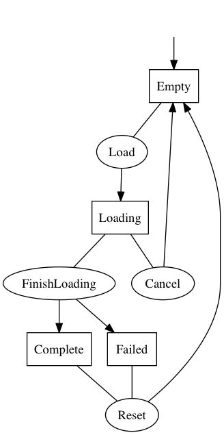

EFStateMachine.swift
====================

[](https://developer.apple.com/swift/)
[](https://raw.githubusercontent.com/Egeniq/EFStateMachine/master/LICENSE)
[](http://cocoapods.org)
[](https://github.com/Carthage/Carthage)

__A Simple State Machine in Swift__

Highlights of this state machine:

* uses enums for states and actions
* uses blocks to run actions and change state
* runs callback handles on state changes
* tracks state history
* creates flow diagram for visual inspection

This state machine is typically setup with an enum for its possible states, and an enum for its actions. The state
of the machine determines wether an action is allowed to run. The state of a machine can only be changed via an
action. The action handler returns the new state of the machine.

It is also possible to register multiple handlers that get run when certain state changes occur.

## Requirements

You need at least iOS 8.0 or Mac OS X 10.9.

This implementation is written using Swift 1.2. A version for Swift 2.0 is available on a separate branch. 

## Documentation

The API is fully documented in the source. See also the [example](#example) below.

## Installation

To install using CocoaPods, add to your Podfile:

    pod 'EFStateMachine', '~> 0.1'

To install using Carthage, add to your Cartfile:

    github "Egeniq/EFStateMachine" ~> 0.1

Or you just compile the source and add the `StateMachine.framework` to your own project.

## Example

Say you want to state machine to capture the flow in this diagram:



First, create an `enum` to hold the states. It should conform to the protocols `Hashable` and `Printable`.

```swift
    enum LoadState: String, Printable {
        case Empty = "Empty", Loading = "Loading", Complete = "Complete", Failed = "Failed"

        var description: String {
            return rawValue
        }
    }
```

The `enum` for the actions is declared the same way.

```swift
    enum LoadAction: String, Printable {
        case Load = "Load", FinishLoading = "FinishLoading", Cancel = "Cancel", Reset = "Reset"

        var description: String {
            return rawValue
        }
    }
```

Now that we have both the states and actions declared, we can create the machine and give it its initial state.

```swift
    let machine = StateMachine<LoadState, LoadAction>(initialState: .Start)
```

For each action, register a handler to run. The handler will only be run if the current state of the state machine is one of those listed in `fromStates`. The handler must return a state, which will become the new state of the state machine.

```swift
    machine.registerAction(.Load, fromStates: [.Start, .Failed], toStates: [.Loading) { (machine) -> StateMachineTests.LoadState in
        return .Loading
    }

    machine.registerAction(.FinishLoading, fromStates: [.Loading], toStates: [.Complete, .Failed) { (machine) -> StateMachineTests.LoadState in
        return .Complete // (or return .Failed if that's the case)
    }
```

Because the state machine keeps track of its state history, you can implement methods to handle cancelling an asynchronous task.

```swift
    machine.registerAction(.Cancel, fromStates: [.Loading], toStates: [.Start, .Failed]) { machine in
        return machine.history[machine.history.count - 2]
    }
```

You can also observe state changes and act upon such events. This is also a good moment to point out that you should be careful not to introduce retain loops. If `self` holds the state machine, you should use `[unowned self` or `[weak self]` with your handler.

```swift
    machine.onChange(toStates: [.Complete]) { [unowned self] (machine, oldState, newState) -> Void in
        self.infoLabel.text = "Complete!"
    }
```

Now your state machine is ready to be used. Performing an action is straightforward. If you get back a state, you know the action was run, if `nil` is returned the action was ignored.

```swift
    // Start loading
    machine.performAction(.Load) // returns .Loading

    // Loading finished
    machine.performAction(.FinishLoading) // returns .Complete and updates infoLabel to "Complete!"

    // Try loading again (an invalid action)
    machine.performAction(.Load) // returns nil
```	

## Flow diagram

To get a flow diagram like shown above, you save the string returned by the `flowdiagramRepresentation` property to a .dot file. You can render the diagram with the free app [GraphViz](http://graphviz.org).

```swift
    let flowdiagram = machine.flowdiagramRepresentation
```
